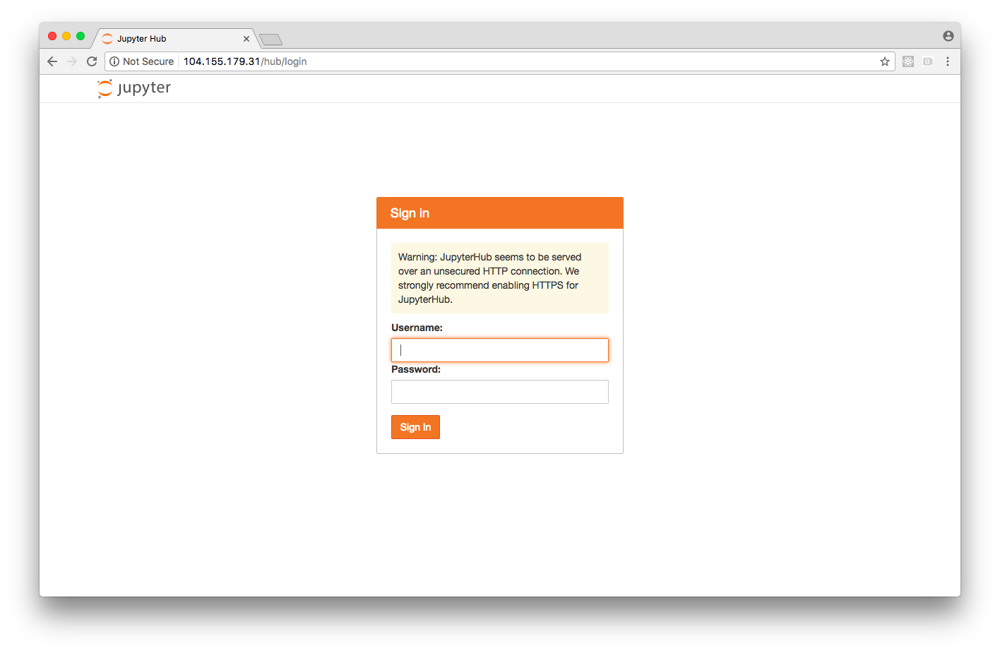
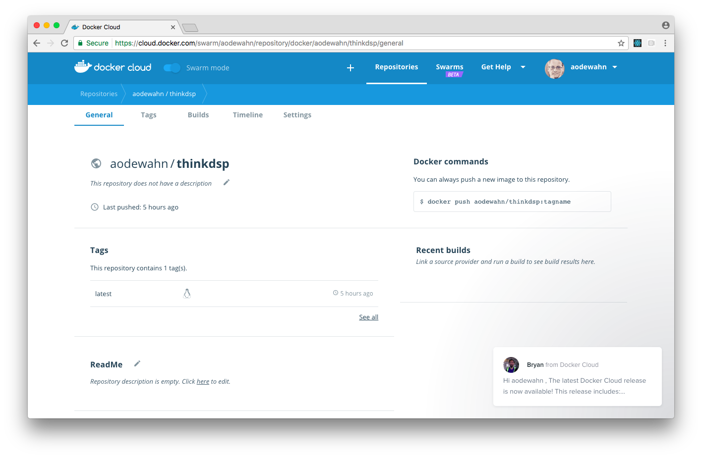
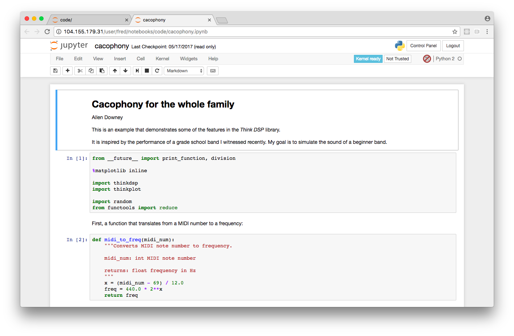

# Deploying JupyterHub on Kubernetes on Google Cloud

[JupyterHub](https://github.com/jupyterhub/jupyterhub), a "multi-user server for Jupyter Notebooks", is an essential tool for teaching and training at scale with Jupyter.  As described in [The course of the future – and the technology behind it
](http://data.berkeley.edu/news/coursefuture), JupyterHub is being used to power an introductory class in Data Science taken by hundreds of students a Berkeley every semester.

Setting up and operating these JupyterLab environments has been out of reach except for organizations with very significant technical capabilities, but recent work by members of the Jupyter team - especially [@CarolWilling](https://twitter.com/WillingCarol), [@minrk](https://twitter.com/minrk), [@Mbussonn](https://twitter.com/Mbussonn), [@yuvipanda](https://twitter.com/yuvipanda), and [@choldgraf](https://twitter.com/choldgraf) -- has put JupyterHub within reach of a host organizations.  Removing the pain of installing and operating JupyterHub opens the doors to the classroom of the future to everyone.  

Their new project, a Helm package for JupyterHub and an accompanying article called [Zero to JupyterHub](http://zero-to-jupyterhub.readthedocs.io/en/latest/) on how to use it, describes the relatively straightforward steps needed to install and run JupyterHub on [Google cloud](https://cloud.google.com).

In this article, I've followed along with the tutorial and added additional details on setting up gcloud, getting a docker content project ready to deploy on it, and some more background on some of the tools used.

## Introduction

Although there are a lot of steps, there are three main things to do:

* Create a k8s cluster.  In a traditional ops setting, this is kind of like setting up a new server, but in this case it's a cluster.
* Install the JupyterHub application on the cluster using [helm](https://github.com/kubernetes/helm), the k8s package manager.
* Configure the new JupyterHub instalce to serve a default content project.  In this case, I'll have it serve Allen Downey's [ThinkDSP](https://github.com/AllenDowney/ThinkDSP) project.  See [Computational Publishing with Jupyter](https://github.com/odewahn/computational-publishing) for more background information on this step.

By the end of this tutorial, you'll have a public server (no DNS entry or https, which is something I'll need to figure out how to add) where anyone can log in and get a running instance of ThinkDSP.

What's not covered here:

* How to set up an "authenticator" for JupyterHub so that you can control who can log into Jupyter and get a notebook.  Right now, anyone can just log in with any username and password.  Probably unwise.
* How to handle persistent storage for the container.  This is [dependent on an unmerged issue on docker-stacks project](https://github.com/jupyter/docker-stacks/pull/388).  So, you won't be able to save the notebooks served via JupyterHub.


## Install the gcloud CLI

You need the [google cloud CLI](https://cloud.google.com/sdk/downloads) for your platform.  Once you download and install it, you should be able to run the `gcloud` tool on your machine:

```
$ gcloud version
Google Cloud SDK 155.0.0
bq 2.0.24
core 2017.05.10
gcloud
gsutil 4.26
```

## Set your login credentials

Once you've got it installed, do `gcloud init` to set your credentials.  This will open a browser and ask you login to the google account where you'll be deploying JupyterHub.

## Install `kubectl` plugin

Install `kubectl`:

```
gcloud components install kubectl
```

You only need to do this once.

## Create a Kubernetes cluster

Once you've got the basic setup, you're ready to [create a kubernetes cluster](http://zero-to-jupyterhub.readthedocs.io/en/latest/create-k8s-cluster.html) where we'll install the JupyterHub server.  In an AWS context, this is kind of like setting up your EC2 instance.

I used the name `notebook-test` as a cluster name with 3 nodes, a single-core high memory [machine types](https://cloud.google.com/compute/docs/machine-types) in the US central zone.  

```
gcloud container clusters create notebook-test \
    --num-nodes=3 \
    --machine-type=n1-highmem-2 \
    --zone=us-central1-b
```

Once the command completes, you can confirm your cluster is running like this:

```
$ kubectl get node
NAME                                           STATUS    AGE       VERSION
gke-notebook-test-default-pool-fc9a005b-64z2   Ready     41s       v1.6.4
gke-notebook-test-default-pool-fc9a005b-rjhm   Ready     43s       v1.6.4
gke-notebook-test-default-pool-fc9a005b-tj84   Ready     44s       v1.6.4
```

## Set up Helm

[Helm](https://helm.sh/) is the package manager for Kubernetes; it's like apt/yum/homebrew for a cluster.  It's used to install charts, which are are packages of pre-configured Kubernetes resources.  


```
$ brew install kubernetes-helm
==> Downloading https://homebrew.bintray.com/bottles/kubernetes-helm-2.4.2.sierr
######################################################################## 100.0%
==> Pouring kubernetes-helm-2.4.2.sierra.bottle.tar.gz
==> Using the sandbox
==> Caveats
Bash completion has been installed to:
  /usr/local/etc/bash_completion.d
==> Summary
🍺  /usr/local/Cellar/kubernetes-helm/2.4.2: 48 files, 122.4MB
```

Then you have to run `helm init`; this has to be done once per k8s cluster.

```
$ helm init
Creating /Users/odewahn/.helm
Creating /Users/odewahn/.helm/repository
Creating /Users/odewahn/.helm/repository/cache
Creating /Users/odewahn/.helm/repository/local
Creating /Users/odewahn/.helm/plugins
Creating /Users/odewahn/.helm/starters
Creating /Users/odewahn/.helm/repository/repositories.yaml
$HELM_HOME has been configured at /Users/odewahn/.helm.

Tiller (the helm server side component) has been installed into your Kubernetes Cluster.
Happy Helming!
```


## Prepare an initial JupyterHub config file

Now we're ready to [set up JupyterHub](http://zero-to-jupyterhub.readthedocs.io/en/latest/setup-jupyterhub.html#setup-jupyterhub) itself.  In a AWS context, this is like we've got the server stood up and now we want to put our application on it.

Generate two random keys that you'll using the in the config file:

```
$ openssl rand -hex 32
b85e9538b93761f2336025a3d5696cc237ee26c8115979d90b86b08b0c326957
$ openssl rand -hex 32
f13056563eafb75ab062020dadef8c941b18f69da623e8af58554c06c585881a
```

Then create a file called `config.yaml` with the following contents:

```
hub:
  cookieSecret: "b85e9538b93761f2336025a3d5696cc237ee26c8115979d90b86b08b0c326957"
token:
  proxy: "f13056563eafb75ab062020dadef8c941b18f69da623e8af58554c06c585881a"
```

You'll need to keep this file around, so be sure to commit it to a GitHub repo. [THIS IS PROBABLY NOT GREAT ADVICE SINCE IT CONTAINS SECRETS, BUT WHAT IS THE BEST WAY TO DO IT?]

## Install JupyterHub with Helm

Now that we have helm, we can (finally!) use `helm install` to put the JupyterHub app on the cluster.  We'll use the config file we created in the previous step, and use the name `jupyterhub-test` as the name and namespace of the application (this is how Helm keeps up with the apps running on the cluster).

```
helm install \
 https://github.com/jupyterhub/helm-chart/releases/download/v0.3.1/jupyterhub-v0.3.1.tgz \
 --name=jupyterhub-test \
 --namespace=jupyterhub-test \
 -f config.yaml
```

This will run for a while.  When it finishes, it will produce some helpful log data, as well as the release notes for the JupyterHub app:

```
NAME:   jupyterhub-test
LAST DEPLOYED: Fri Jun  2 10:29:44 2017
NAMESPACE: jupyterhub-test
STATUS: DEPLOYED

RESOURCES:
==> v1/PersistentVolumeClaim
NAME        STATUS   VOLUME                       CAPACITY  ACCESSMODES  STORAGECLASS  AGE
hub-db-dir  Pending  hub-storage-jupyterhub-test  1s

==> v1/Service
NAME          CLUSTER-IP     EXTERNAL-IP  PORT(S)       AGE
hub           10.11.246.154  <none>       8081/TCP      1s
proxy-api     10.11.240.251  <none>       8001/TCP      1s
proxy-public  10.11.254.221  <pending>    80:30746/TCP  1s

==> v1/Secret
NAME        TYPE    DATA  AGE
hub-secret  Opaque  2     1s

==> v1/ConfigMap
NAME          DATA  AGE
hub-config-1  14    1s

==> v1beta1/Deployment
NAME              DESIRED  CURRENT  UP-TO-DATE  AVAILABLE  AGE
hub-deployment    1        1        1           0          1s
proxy-deployment  1        1        1           0          1s

==> v1beta1/StorageClass
NAME                                 TYPE
single-user-storage-jupyterhub-test  kubernetes.io/gce-pd  
hub-storage-jupyterhub-test          kubernetes.io/gce-pd  


NOTES:
Thank you for installing JupyterHub!

Your release is named jupyterhub-test and installed into the namespace jupyterhub-test.

You can find if the hub and proxy is ready by doing:

 kubectl --namespace=jupyterhub-test get pod

and watching for both those pods to be in status 'Ready'.

You can find the public IP of the JupyterHub by doing:

 kubectl --namespace=jupyterhub-test get svc proxy-public

It might take a few minutes for it to appear!

Note that this is still an alpha release! If you have questions, feel free to
  1. Come chat with us at https://gitter.im/jupyterhub/jupyterhub
  2. File issues at https://github.com/jupyterhub/helm-chart/issues
```

As you can see in the release notes from the log, it will take a while to for the app to initialize.  Here's the instruction you can run to monitor its progress:

```
$ kubectl --namespace=jupyterhub-test get svc proxy-public
NAME           CLUSTER-IP      EXTERNAL-IP   PORT(S)        AGE
proxy-public   10.11.254.221   <pending>     80:30746/TCP   36s
```

After a minute or two, the external IP field will be populated and the JupyterHub app is available:

```
$ kubectl --namespace=jupyterhub-test get svc proxy-public
NAME           CLUSTER-IP      EXTERNAL-IP      PORT(S)        AGE
proxy-public   10.11.254.221   104.155.179.31   80:30746/TCP   4m
```

Then you can open you browser to `http://104.155.179.31` and boom!, Notebooks:



Note that JupyterHub is running with a default dummy authenticator, so you can just enter any username and password. See [extending jupyterhub](http://zero-to-jupyterhub.readthedocs.io/en/latest/extending-jupyterhub.html) for details on how to set up authentication, which I won't cover here.

## Prepare Default Notebook to run on JupyterHub

By default, JupyterHub just gives you a blank Notebook.  However, if you're teaching a class or something, and you want to give your students access to something you've already created, you need to prepare a docker image that will be served by default.

To make a Docker image you can deploy onto JupyterHub, you need to `ADD` the repo to the `/home/jovyan` directory, and then set the `WORKDIR` to `/home/jovyan`.  

If you're using Launchbot or otherwise have an existing Dockerfile, you can create a new Dockerfile and call it `Dockerfile.prod`.  For example:

```
FROM jupyter/scipy-notebook:latest

ADD . /home/jovyan

WORKDIR /home/jovyan

# Expose the notebook port
EXPOSE 8888

# Start the notebook server
CMD jupyter notebook --no-browser --port 8888 --ip=*
```

Once you have this, build the image:

```
docker build -f Dockerfile.prod . aodewahn/thinkdsp
```

Then you'll need to log into the Docker Hub and create an image for it.  Once you do, you can do

```
docker push aodewahn/thinkdsp
```



## Deploying the Default Image to JupyterHub

Once we've made a default image, we need to update the `config.yaml` we created earlier to make it be our default images.  (This is all covered in the [extending jupyterhub](http://zero-to-jupyterhub.readthedocs.io/en/latest/extending-jupyterhub.html) article).  

To do it, add this section that maps the image to the image we just put on DockerHub:

```
singleuser:
  storage:
    type: none
  image:
    name: aodewahn/thinkdsp
    tag: latest
```

Next, get the release name of the app, which you set up earlier.  Note that if you forget the name, you can use `helm` to retrieve it:

```
$ helm list
NAME           	REVISION	UPDATED                 	STATUS  	CHART            	NAMESPACE      
jupyterhub-test	1       	Fri Jun  2 10:29:44 2017	DEPLOYED	jupyterhub-v0.3.1	jupyterhub-test
```

Then upgrade the cluster (this is what the doc says is necessary):

```
helm upgrade jupyterhub-test https://github.com/jupyterhub/helm-chart/releases/download/v0.3/jupyterhub-v0.3.tgz -f config.yaml
```

You can run this command until the container is built:

```
$  kubectl --namespace=jupyterhub-test get pod
NAME                                READY     STATUS              RESTARTS   AGE
hub-deployment-1010241260-x506q     0/1       ContainerCreating   0          57s
proxy-deployment-2951954964-l94n5   1/1       Running             0          2h
```

Once it's done building, you should be able to create a new notebook based on the base image.



Note that for now JupyterHub doesn't support persistent storage with the jupyter-stack images, but they're working on it.

## Delete the cluster

Once you're done, delete your cluster in order to stop further billing!

```
gcloud container clusters delete notebook-test --zone=us-central1-b
```
